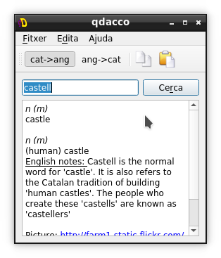
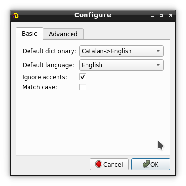
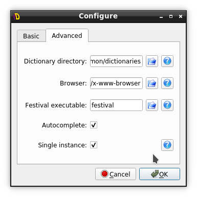

# qdacco (English)
(en català més avall)

## What is DACCO?
DACCO stands for "Diccionari Anglès-Català de Codi Obert" or "English-Catalan Open Source Dictionari". This project was very active around 2000 to 2010 and then it lost the activity.

The last known DACCO version (0.9) has more than 20.000 entries from English to Catalan and from Catalan to English. This makes it useful for everyone.

## What is qdacco?
In 2005 and in order to use DACCO quickly off-line (desktop software) qdacco was written: a frontend of DACCO files. It's a small desktop application.

## Installation instructions
qdacco is packaged in Debian and can be installed in Debian, Ubuntu and others simply doing:

`$ sudo apt install qdacco`

To execute it, from a terminal or launcher:

`$ qdacco`

For more installation instructions: see [INSTALL.en.md](INSTALL.en.md)

# qdacco (Català)
## Què és DACCO?
DACCO vol dir "Diccionari Anglès-Català de Codi Obert". El projecte era molt actiu entre el 2000 i 2010, llavors va perdre activitat.

## Què és qdacco?
El 2005 i per utilitzar DACCO més ràpidament des d'un ordinador sense connexió (via programari on via Web) vàrem escriure qdacco: una interfície pels fitxers DACCO. És una petita aplicació.

## Instruccions d'instal·lació
qdacco està empaquetat a Debian i pot ser instal·lat fàcilment a Debian, Ubuntu i altres fent:

`apt install qdacco`

I per executar-ho:
`qdacco`

Per a més informació de l'instal·lació: veure [INSTALL.ca.md](INSTALL.ca.md)

## Screenshots / captures de pantalla

